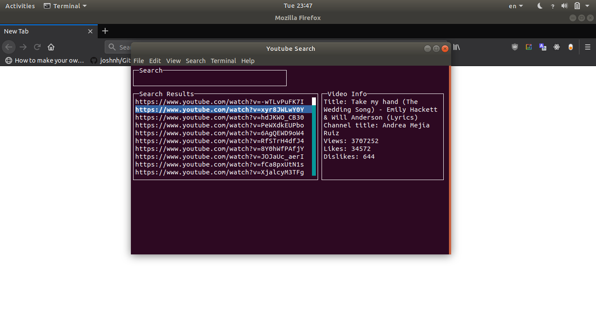
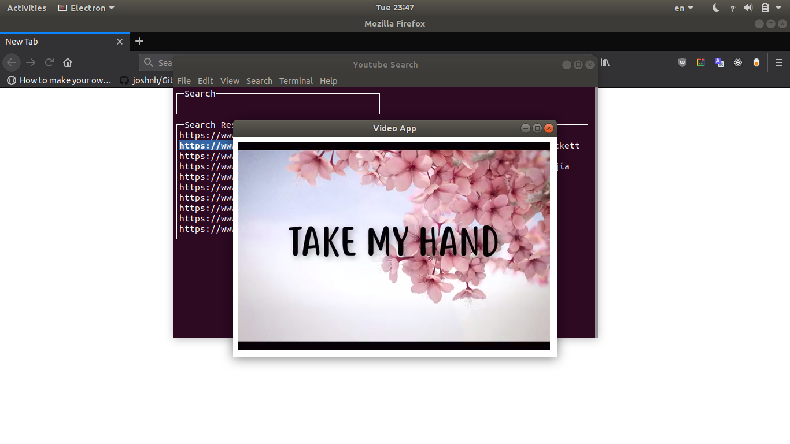

# Youtube Search on Terminal.
> Fun and useless app for searching youtube's videos on terminal.





## Usage

```sh
git clone https://github.com/thanhdinh98/Youtube-on-terminal.git

cd Youtube-on-terminal && npm install
```

```sh
node source/index your_youtube_api_key
```

Or set your alias command

```sh
alias s='cd ~/path/to/clone/folder && node source/index your_api_key && cd ~/'
```

**Note**: Create your own Youtube ApiKey on [Google Console](https://console.developers.google.com)

## Short keys

* On Screen:
    * s: focus on search box
    * f: focus on result box
    * Control-C: quit app

* On Search box:
    * Enter: submit
    * Esc: focus on screen

* On Result box:
    * Enter: select video
    * p: play video
    * Esc: focus on screen
    * arrow keys: move to next/previous video

## Author

**Thanh Dinh**


